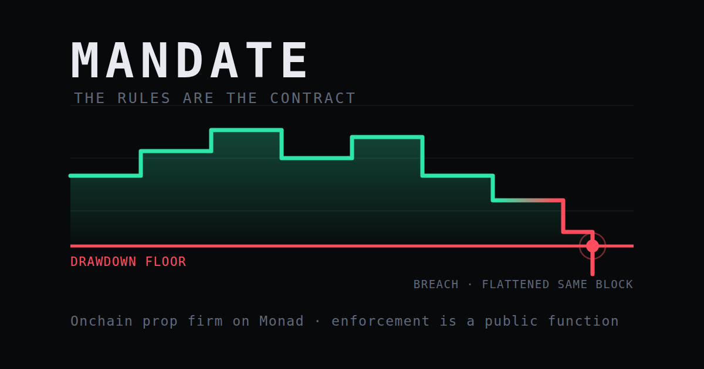

<div align="center">



# Mandate

### The rules are the contract.

**An onchain prop firm on Monad.** LPs deposit capital. Traders receive a *mandate* — an
allocation with encoded terms. A keeper marks equity every block. Breach the drawdown and
the contract flattens the position and revokes the mandate in the same block.

No payout desk. No discretion. No "we reviewed your trading and found a violation" email.

[Architecture](#architecture) · [Why Monad](#why-this-needs-monad) · [Quickstart](#quickstart) · [Sponsors](#sponsor-integrations)

</div>

---

## The problem

Prop firms hand traders capital under a rulebook: max drawdown, daily loss limit, position
cap, profit split. Every one of those rules lives in a PDF, and every one is enforced by a
private server you have to trust. When the risk engine says you breached, you breached.
When the payout desk says no, it's no.

I trade a funded account. I blew two before this one. The rules were a PDF, the risk engine
was a black box, and the payout was somebody's decision.

And here is the part most people miss: **the drawdown is almost never what they deny you on.**
That number is unambiguous — you can see it on your own platform. They deny you on the
**consistency rule**: *your biggest winning day was more than 15% of your total profit.* That
number is computed on their server, from their record of your trades, against a threshold you
cannot independently check. The rule itself is reasonable. Its privacy is not.

## What this actually is

**Not a prop firm. The market that replaces one.**

A prop firm publishes one set of terms — 10% drawdown, 80/20, pay us $500 to try — and every
trader takes it or leaves. Terms are announced, not priced. And by their own description,
*"the firm's revenue comes from two sources: challenge fees paid upfront, and a percentage of
profitable traders' gains."* **They earn when you fail.**

Worse: prove yourself at one firm and you start from zero at the next, because your record
doesn't travel. That's why funded traders juggle 2–5 accounts and keep paying challenge fees.

Mandate replaces that with a market:

| | Prop firm | Mandate |
|---|---|---|
| Who sets terms | The firm, one menu for everyone | Any LP, competing |
| Entry cost | Challenge fee, non-refundable | None |
| Who profits if you fail | The firm | Nobody |
| Your track record | Trapped inside that firm | Yours, portable, verifiable |
| Who enforces the rules | Their private server | A public function anyone can call |

An LP posts capital behind the record they want — *"no breaches, 3 settled mandates, best
consistency under 25%: $250,000 at 92/8"*. Any trader who meets it takes it. No approval, no
negotiation. Two LPs who want the same trader compete by improving their terms.

**Why nobody has built this.** A market can't price a claim. It needs a record a stranger can
trust without trusting its author — and a prop firm can't credibly vouch for a trader to a
competitor. Our registry doesn't *attest* to your record, it *produces* it: every field is
written by the same contract that enforced the rules it describes. No oracle, no issuer.
`registry.recordOf(you)` is a primary record, and it's why the market underneath it can exist.

## We are not first at onchain prop firms, and the difference matters

Onchain prop firms already exist. [Propr.xyz](https://propr.xyz) (XBorg, backed by SwissBorg),
Hypernova, Vanta Trading (Taoshi + Hyperliquid), GT Funded and others all launched in 2026.
Anyone claiming to have invented this category has not looked.

What they put onchain is narrower than the marketing suggests:

| | Rule definitions | Payout settlement | **Breach detection & enforcement** |
|---|---|---|---|
| Existing onchain prop firms | ✅ onchain, immutable | ✅ onchain, USDC | ❌ private server |
| **Mandate** | ✅ | ✅ | ✅ **onchain, permissionless** |

DeFiPrime's survey of the category puts it exactly right:

> "Disclosing the engine in plain language is a real step past MyForexFunds, but
> **'trust our classifier' is not the same as 'verify.'**"

So the claim is specific and checkable: the category has made the *rules* and the *payout*
onchain. The **risk engine that decides whether you breached** is still somebody's server.
Mandate puts the enforcement loop itself onchain, and lets anyone run it — and then builds the
thing that only becomes possible once you have: a market where capital prices trader risk
directly, on a record nobody has to be trusted to vouch for.

That is also the honest answer to "why Monad." An enforcement loop has to mark every open
account every block, and that is only affordable at 400ms blocks and sub-cent gas. It is not
that Monad is faster — it is that **the enforcement layer is the part nobody has built, and
this is the first chain where building it is economically possible.**

## What Mandate does

A **mandate** is an allocation of pooled capital plus enforceable constraints on how it's
used, legible to both sides before either commits:

**Risk terms** — checked pre-trade, and again on every block:

| Term | Meaning |
|---|---|
| `allocation` | Capital granted to the trader |
| `maxDrawdownBps` + `drawdownMode` | Static, trailing, or trailing-until-breakeven — all three real models |
| `dailyLossBps` | Loss limit, measured from `max(day-start balance, day-start equity)` |
| `maxPositionBps` | Notional cap as a multiple of allocation |
| `expiry` | Mandate deadline |
| `touchIsBreach` | Whether touching the floor breaches, as real firms do |

**Payout terms** — checked when the trader tries to take profit:

| Term | Meaning |
|---|---|
| `maxConsistencyBps` | Biggest winning day as a share of total profit |
| `minProfitableDays` | Profitable days required before a withdrawal |
| `payoutCushionBps` | Headroom above the floor required to pay out |
| `profitSplitBps` | Trader's share of profit at settlement |

The second table is the one that makes this different. Anyone can call
`registry.consistencyScore(id)` and get the exact number a prop firm would compute for you in
private — and `payoutEligibility(id)` tells you which condition is blocking you, if any. The
registry owner cannot override it. A payout condition an operator can wave through is a payout
condition that means nothing.

Payout conditions are **soft**: a failed condition withholds the reward and leaves the mandate
open, so the trader keeps trading until it clears. That is how real firms treat them, and it
is the right behaviour — being inconsistent is not misconduct.

## Why this needs Monad

The product is a continuous risk loop: mark every open mandate against live prices,
recompute trailing equity peaks, enforce. On a 12-second chain at real gas prices,
monitoring a few hundred accounts costs more than the fees earn — which is exactly why
every existing prop firm runs its risk engine on a private server you have to trust.

At 400ms blocks and sub-cent gas, trust-minimised enforcement becomes affordable for the
first time. The claim is not "Monad is faster so it's better." It's that **the enforcement
loop is only economically viable at this block time and gas cost.**

## `enforce()` is permissionless

Anyone can call it — any LP, any observer, any competing trader. The keeper is a
convenience, not a trust assumption. That's the property that distinguishes this from a
prop firm's private server.

## Architecture

```
LP deposits ──► CapitalPool ──► allocates ──► MandateAccount (one per mandate)
                    ▲                              │
                    │                              ▼
              profit split                    perp venue
                    │                              │
                    └────── RiskEngine ◄───────────┘
                                 ▲
                          Keeper (every block)
```

| Component | Path | Role |
|---|---|---|
| **`UnderwritingBook`** | `contracts/src/` | **The market — LPs post offers, traders claim on record** |
| `RiskEngine` | `contracts/src/` | Pure drawdown/daily-loss/settlement maths |
| `MandateAccount` | `contracts/src/` | Per-mandate clone, pre-trade constraint checks |
| `MandateRegistry` | `contracts/src/` | Issuance, state, permissionless `markAndEnforce` |
| `CapitalPool` | `contracts/src/` | ERC-4626-style LP vault, allocation + settlement |
| Keeper | `keeper/` | Block subscriber, batched marks, gas accounting |
| Indexer | `indexer/` | Envio HyperIndex — equity curves, fill history |
| Frontend | `web/` | Trader view (equity curve + floor), LP view |

## Try it (testnet, free, no signup)

1. Open the app and **sign in** — connect a wallet, then sign a message. It's a signature,
   not a transaction: it costs nothing and moves no funds
2. Click **Claim a mandate** — you get $100k of testnet capital under enforced terms
3. Trade it. Watch the distance-to-floor readout move against you
4. Breach the 10% trailing drawdown or the 5% daily limit and the contract flattens your
   position and takes the mandate back, in the same block

Nobody approves the claim and nobody can refuse the payout. That is the whole idea, and
breaking it is the interesting part — [`DemoIssuer.sol`](contracts/src/DemoIssuer.sol) hands
out one mandate per address on fixed, published terms.

## Quickstart

```bash
cp .env.example .env      # fill in PRIVATE_KEY and RPC
make install
make build
make test
```

Deploy and drive the demo:

```bash
make deploy-testnet
make seed
make demo                 # healthy mandate -> adverse move -> breach -> flatten
```

## The number that makes the argument

A mark costs **106,718 gas — about 0.00011 MON**, measured, not estimated
(`keeper/data/marks.json` records every one). Marks are batched, so a per-block risk loop over
hundreds of accounts is affordable.

That is the entire case for building this on Monad, and it is a narrow claim on purpose: not
"Monad is fast so it's better," but *this specific enforcement loop is only economically
viable at this block time and gas cost.* On a 12-second chain at real gas prices, marking a
few hundred accounts every block costs more than the fees earn — which is exactly why every
incumbent prop firm runs its risk engine on a private server you have to trust.

## Status

Built for **Monad Metropolis**, Onchain Finance & Trading track.
See [SPEC.md](SPEC.md) for the build specification.

- [x] Phase 0 — Scaffold
- [x] Phase 1 — Venue gate resolved ([findings](docs/PHASE1-FINDINGS.md))
- [x] Phase 2 — Core contracts
- [x] Phase 3 — 250 tests, 10 invariants, fuzz
- [x] Phase 4 — Keeper
- [x] Phase 5 — Trader + LP frontend
- [x] Phase 6 — Envio indexer
- [x] Phase 7 — Deploy + seed
- [x] Phase 8 — Live breach demo

```
forge test    250 passed, 0 failed
coverage      RiskEngine 100% · MandateRegistry 100% · DemoIssuer 100%
              95.52% lines across contracts/src (the deploy script is excluded —
              coverage of a deploy script measures nothing)
```

## Sponsor integrations

Three, all load-bearing. No checkbox integrations.

| Sponsor | What it does here | Where | Why it is not decorative |
|---|---|---|---|
| **Perpl** — API / automation | The risk keeper is a production automation system built on Perpl's public API: runtime market discovery, live oracle relay, batched enforcement, reconnect and backoff. | [`keeper/src/index.ts`](keeper/src/index.ts), [`keeper/src/perpl.ts`](keeper/src/perpl.ts) | Mandates are marked, and breaches triggered, against Perpl's real oracle prices. Cut the feed and enforcement stops. |
| **Perpl** — Analytics / risk tool | Trader and LP risk dashboards over that feed: equity vs floor, distance-to-floor per block, per-mandate headroom for LPs. | [`web/`](web/) | It is the product surface, not a readout bolted on. |
| **Envio** — HyperIndex | Indexes the enforcement loop and serves the equity curve over GraphQL. | [`indexer/`](indexer/) | Monad's public RPC caps `eth_getLogs` at **100 blocks** — 40 seconds of history. The core trader screen is not buildable without an indexer. |

### A note on Perpl

Perpl **is** live on Monad testnet and we verified it end to end
([`scripts/spike-perpl.ts`](scripts/spike-perpl.ts) reproduces every claim). It is not the
settlement venue, and the reason is worth stating plainly rather than hiding:

Perpl authenticates with Ed25519 key pairs and places orders over an authenticated WebSocket.
It does not support EIP-1271 contract signatures. **A smart contract cannot close a Perpl
position.** Mandate's whole claim is that *the contract* flattens a breached position and
anyone can trigger it — routing that through an off-chain keyholder would rebuild the trusted
private risk server this project exists to remove.

So settlement happens in [`MiniPerp.sol`](contracts/src/venue/MiniPerp.sol), which mirrors
Perpl's live market configuration (same market ids, margin, 0.069% taker fee, 2580s funding
interval) and marks against Perpl's own oracle. Full reasoning in
[`docs/PHASE1-FINDINGS.md`](docs/PHASE1-FINDINGS.md).

## Testing

```bash
make test        # 250 tests
make auth-check  # sign-in flow + every replay and forgery path it must refuse
make coverage    # RiskEngine 99%, MandateRegistry 100%, 95%+ across src/
make smoke       # renders both pages in a real browser, fails on any console error
```

`make smoke` exists because of a specific miss: the frontend once threw on load and rendered
nothing, while `tsc`, `next build` and a 200 from `curl` were all green — the data path only
runs client-side. A passing build is not evidence a page works.

The boundary cases are the point. A drawdown rule that fires one wei early confiscates an
account for nothing; one that fires late is a rule the pool cannot rely on. So the floor
comparison is asserted at exactly ±1 wei on both sides.

Ten invariants hold across ~16,000 random calls — no Active mandate below its floor at its
last mark, high-water marks are peaks, the registry never holds assets between transactions,
every asset unit is accounted for across all participants, settlement legs sum to the equity
that came back.

Two of those invariants are interesting for what they *rejected*. The position cap was first
written as a state invariant on mark-priced notional; the fuzzer broke it with two consecutive
up-moves, correctly — a position that grew because the trade went the trader's way is not a
violation. Rewritten against entry-priced notional, the fuzzer broke it again by adding to a
position after a price fall, also correctly. The cap constrains *orders*, not positions. Both
rejected versions are documented in
[`test/invariant/Mandate.invariant.t.sol`](contracts/test/invariant/Mandate.invariant.t.sol),
because the cap means something more specific than it first appears.

## Known limitations

Stated because a judge will find them anyway, and volunteering the weak case with a number
attached is most of the gap between third place and first.

- **A trader could dump the pool's capital into a deliberately losing trade.** Position caps,
  a per-block loss limit that fires before meaningful size can move, and a venue where the
  counterparty is not chosen. **Mitigated, not solved.**
- **Share price trails the market by one mark.** `totalAssets()` counts mandate equity at its
  last marked value. At 400ms blocks the window is small, but it is not zero. The withdrawal
  delay plus claim-time pricing is what stops it being farmed.
- **Breach losses socialise across LPs** pro rata. The 20% per-mandate allocation cap is what
  bounds them.
- **MiniPerp's solvency is an assumption, not a market outcome.** It has no order book and so
  no natural counterparty; winning positions are paid from a reserve. That is a property of a
  test venue, not of the risk engine.
- **Oracle dependence.** Equity marks are only as good as the price feed. Every settlement
  path calls `priceNoOlderThan`, and the deviation guard that protects against a compromised
  publisher can also stall marking in a genuine gap. Both directions are documented in
  [`PriceOracle.sol`](contracts/src/oracle/PriceOracle.sol).

## Answers to the obvious questions

**"Why can't a prop firm just do this off-chain?"**
They do — that is the entire status quo, and it requires trusting their server. The claim is
not that enforcement is novel; it is that *verifiable* enforcement just became affordable.

**"What if the keeper goes down?"**
`markAndEnforce` is permissionless. Any LP, any observer, any competing trader can call it.
[`DEPLOY.md`](DEPLOY.md) has the command to prove it rather than assert it.

**"Isn't this just a vault with extra steps?"**
A vault allocates capital. A mandate allocates capital *plus enforceable constraints on how it
is used*, legible to both sides before either commits. That is the primitive.

**"Propr and Hypernova already exist. What's left?"**
The enforcement layer. They publish immutable rule definitions and settle payouts onchain,
both real improvements on MyForexFunds. Neither documents onchain breach detection, and
neither lets a third party enforce. Ours is one public function with no access modifier —
`markAndEnforce`. [DEPLOY.md](DEPLOY.md) has the command to run it yourself against a live
mandate from any key you like.

**"Why should I believe you can enforce the consistency rule fairly?"**
You shouldn't have to believe it. `consistencyScore(id)` is a view function over public state.
Read the number, re-derive it by hand from the `EquityMarked` events, and check ours matches.
That is the entire difference between this and a support ticket.

## License

MIT
